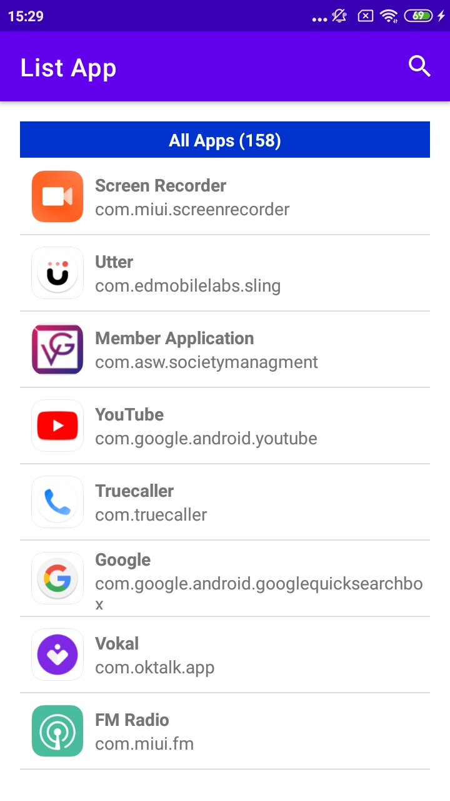

# All-Install-App-List
Get List of User Installed Apps with icon, title, package name programmatically

    We use custom ListView to display installed apps.
      ✓ Display User Installed Apps in ListView with icon, title, package
      ✓ Display total number of User Installed apps
      ✓ Handle On click(Display dialog to open app or open app info)

 Home screen                               | Searching Any Application                                     |
:------------------------------------------:|:-------------------------------------------:
||
